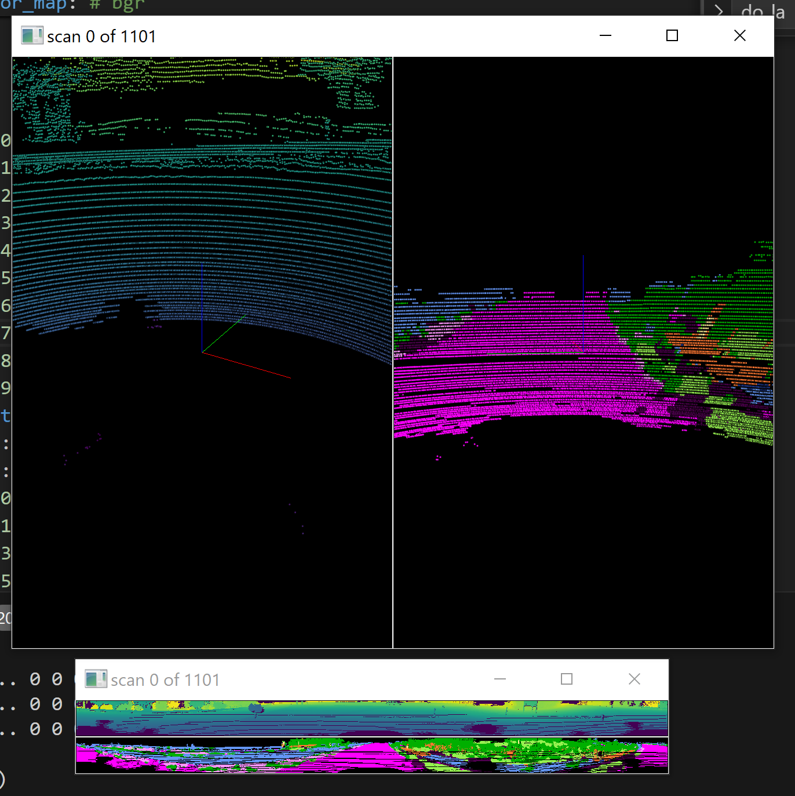
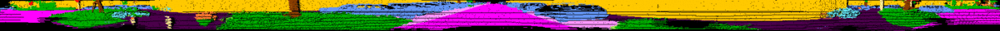

# Point cloud segmentaion on the SemanticKITTI data set

Machine Perception summer 2024.

Daniel Jankowski 148257 and Kacper Dobek 148247.

Our code is based on the SemanticKITTI API and the RangeNet++ repository.

#### Environment setup

Create a Python 3.9.19 conda environment using `train\tasks\semantic\environment.yml`.

### Approach

Do to computational limitations, we built our segmentation model using only two training sequences. The U-Net style model was trained on projections of point clouds (2D range images of resolution 1024x64).

Steps followed in the project:
1. Seek ways to reduce the computational load.
    - use range images
    - merge some classes
2. Export range images from point clouds (sequences 00, 01, 02)
    - file `train\tasks\semantic\save_range_images.py`
3. Train a U-net (Colab notebook)
4. Evaluate the model
5. Save predictions for sequence 01, which is out test sequence.
6. Load predictions, reproject range images to point clouds, and apply KNN postprocessing.
7. Visualize labeled point clouds. Run the `train\tasks\semantic\visualize.py` script.

Range images dataset: https://drive.google.com/file/d/1HBrPWl4ZVcykPgczopDOEvfx35BZNLYO/view?usp=sharing. Download the dataset and put in the `train\tasks\semantic` folder.

Predictions for sequence 01: https://drive.google.com/file/d/17GnNFy9vp8zg2IbZFsR__Vgnh4sRWnI7/view?usp=sharing. Download predictions and put in the `train\tasks\semantic` folder.

The `save_range_images.py` and `visualize.py` scripts require to pass extra command line parameters:
- path to the dataset
- sequence number
- config file

To visualize our predictions, open terminal in `train\tasks\semantic` and run the following command:

```bash
python .\visualize.py -s 01 -d \data_odometry_velodyne\dataset -c config/labels/semantic-kitti-mod-vis.yaml
```



## LiDAR-Bonnetal

Semantic Segmentation of point clouds using range images.

Developed by [Andres Milioto](http://www.ipb.uni-bonn.de/people/andres-milioto/), [Jens Behley](http://www.ipb.uni-bonn.de/people/jens-behley/), [Ignacio Vizzo](http://www.ipb.uni-bonn.de/people/ignacio-vizzo/), and [Cyrill Stachniss](http://www.ipb.uni-bonn.de/people/cyrill-stachniss/)

_Examples of segmentation results from [SemanticKITTI](http://semantic-kitti.org) dataset:_



## Description

This code provides code to train and deploy Semantic Segmentation of LiDAR scans, using range images as intermediate representation. The training pipeline can be found in [/train](train/). We will open-source the deployment pipeline soon.


### Pretrained models: Model and Dataset Dependent

The pretrained models with a specific dataset maintain the copyright of such dataset.

## Citations

If you use our framework, model, or predictions for any academic work, please cite the original [paper](http://www.ipb.uni-bonn.de/wp-content/papercite-data/pdf/milioto2019iros.pdf), and the [dataset](http://semantic-kitti.org).

```
@inproceedings{milioto2019iros,
  author    = {A. Milioto and I. Vizzo and J. Behley and C. Stachniss},
  title     = {{RangeNet++: Fast and Accurate LiDAR Semantic Segmentation}},
  booktitle = {IEEE/RSJ Intl.~Conf.~on Intelligent Robots and Systems (IROS)},
  year      = 2019,
  codeurl   = {https://github.com/PRBonn/lidar-bonnetal},
  videourl  = {https://youtu.be/wuokg7MFZyU},
}
```

```
@inproceedings{behley2019iccv,
  author    = {J. Behley and M. Garbade and A. Milioto and J. Quenzel and S. Behnke and C. Stachniss and J. Gall},
  title     = {{SemanticKITTI: A Dataset for Semantic Scene Understanding of LiDAR Sequences}},
  booktitle = {Proc. of the IEEE/CVF International Conf.~on Computer Vision (ICCV)},
  year      = {2019}
}
```